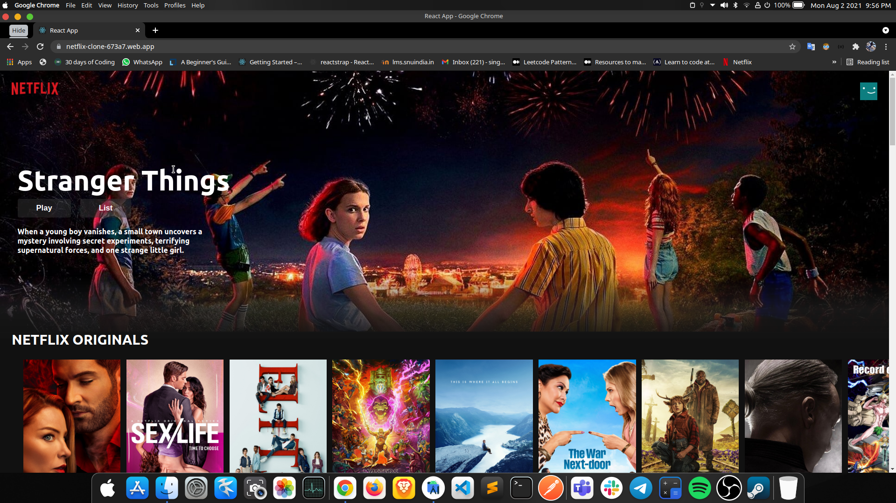

#Netflix Clone
Clone of the famous streaming App, Netflix.

visit the app at: https://netflix-clone-673a7.web.app/

Please show some ❤ by 🌟 the repository.

# Getting Started with Create React App

This project was bootstrapped with [Create React App](https://github.com/facebook/create-react-app).

## Available Scripts

In the project directory, you can run:

### `yarn start`

cd into the directory 
then run "npm i" to install all the dependencies
Runs the app in the development mode.\
Open [http://localhost:3000](http://localhost:3000) to view it in the browser.

